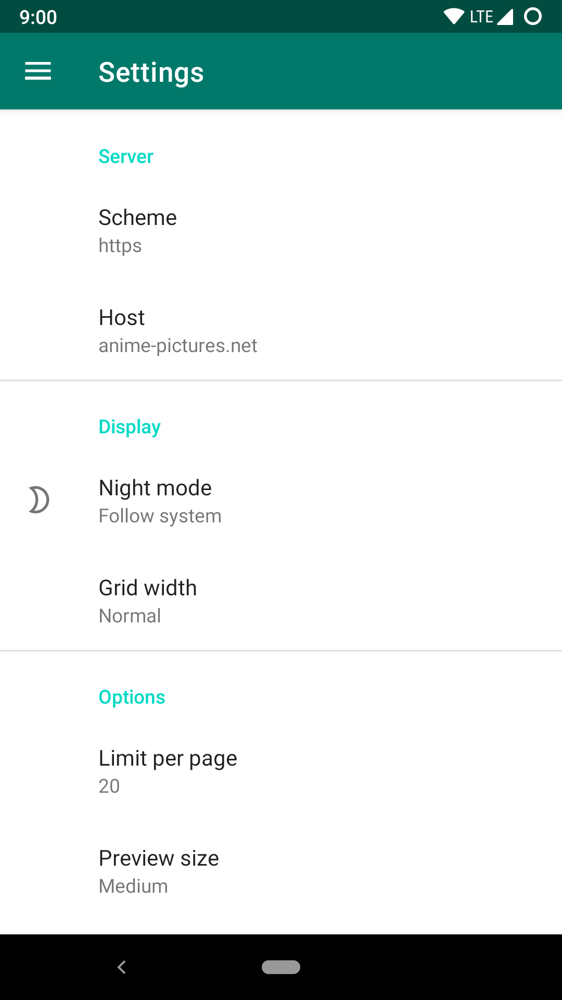
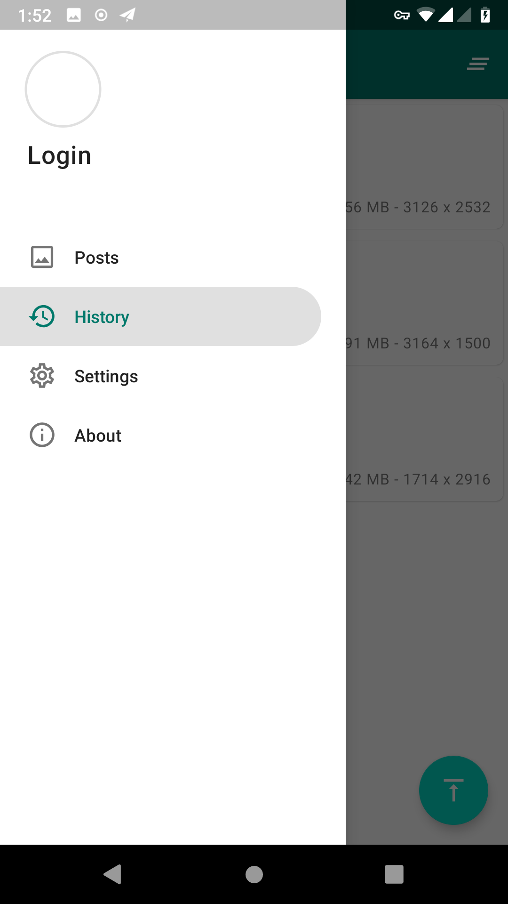
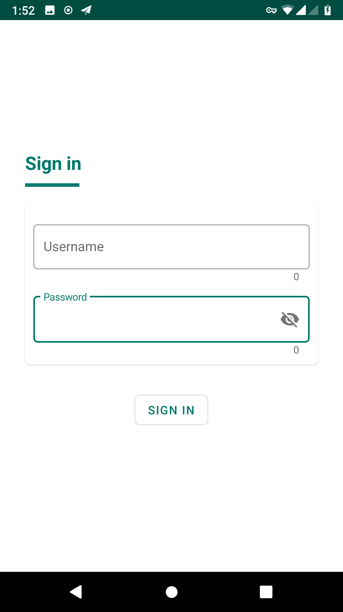
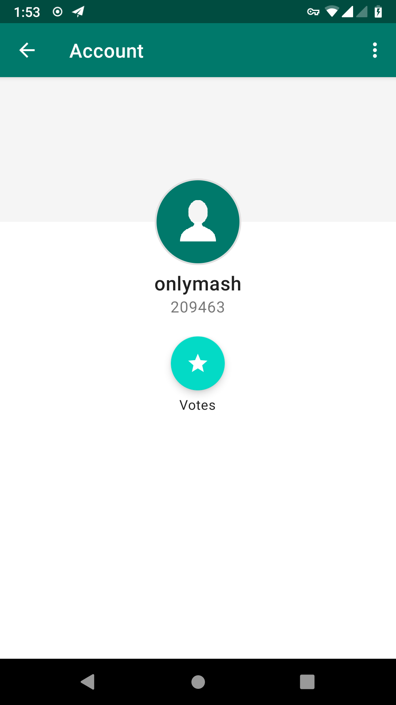

# Flex/AP

An [anime-pictures](https://anime-pictures.net) client for Android.

## Translate
Click on this [link](https://crowdin.com/project/flexbooru-ap) and you can translate this app into your language.

## Downlad

- Tips: Change the Host to anime-pictures.net when launching the app for the first time.

<a href="https://play.google.com/store/apps/details?id=onlymash.flexbooru.ap">

## Screenshot

   
